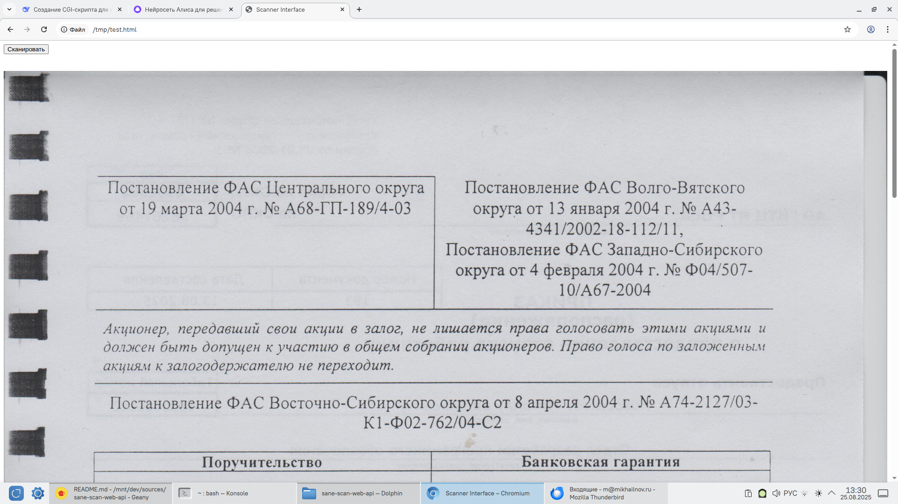

# Сканирование через браузер в Linux

## Что это?

В этом репозитории приведен пример сканирования через браузер в Linux (ROSA/МОС/МосТех). Это что-то вроде web/HTTP API для SANE.

Лицензия: MIT.

## Как это работает

Кладем `scan.cgi` в папку веб-сервера для CGI-скриптов, например, `/var/www/cgi-bin/`. Делаем его исполняемым. При обращении по адресу `http://веб-сервер/cgi-bin/scan.cgi` веб-сервер запустит этот скрипт как исполняемый файл (то есть все равно, на каком языке он будет написан), прочитает его stdout и передаст http-клиенту (юраузеру).

`scan.cgi` запускает консольную программу для сканирования `scanimage`, ждет окончания сканирования и, как только сканирование завершено, не дожидаясь, пока лампа сканера уедет на место, отдает изображение.

В `test.html` пример клиентской части на HTML и JavaScript с кнопкой "Сканировать", при нажатии на которую запускается сканирование и выводится отсканированное изображение.

В качестве примера в `scan.cgi` прописан сканер `genesys:libusb:001:040`. Нужно прописать свой сканер, узнать идентификатор можно командой `scanimage --list-devices`.

Написано с использованием нейросетей DeepSeek и Яндекс Алиса.

## Инструкция по запуску

Установка и запуск на Росе/МОС/МосТех.

* Ставим веб-сервер: `sudo dnf install httpd`
* Запускаем веб-сервер: `sudo systemctl enable --now httpd`
* Кладем серверную часть в нужную папку: `sudo install -m755 scan.cgi /var/www/cgi-bin/`
* Открываем `test.html` и пробуем отсканировать. Логи веб-сервера по умолчанию в `/var/log/httpd/`.

## Видео

https://github.com/user-attachments/assets/dda02c10-0cd9-444d-a28a-983fe18ab5bd

